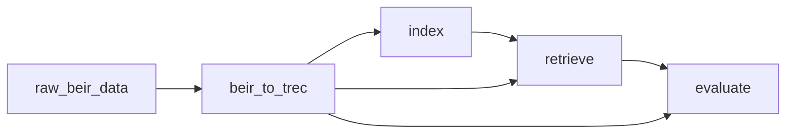

# Task composition

In the previous section, we saw how to define a task with parameters. In this section, we will see how to compose tasks together to form a pipeline.

To run the BEIR benchmark with the Pyserini package, we envision the following pipeline:

Essentially, our pipeline consists of the following steps:
 - Download the raw data in `raw_beir_data`;
 - Preprocess the data to the standard TREC format in `beir_to_trec`;
 - Index the data in `index` to create a BM25 index (depending on the preprocesed data);
 - Retrieve the top-100 documents for each query in `retrieve` (depending on the index and the data);
 - Evaluate the retrieval results in `evaluate` (depending on the data and the retrieved results).

To compose these tasks, we need to define the dependencies between them. This is done by specifying the output of one task as the input of another task.

```python
task raw_beir_data(beir_dataset=$, beir_url_prefix=$) -> out:
  ...
  
task beir_to_trec(data=$raw_beir_data.out) -> out:
  ...

task index(data=$beir_to_trec.out) -> out:
  ...

task retrieve(data=$beir_to_trec.out, index=$index.out) -> out:
  ...

task evaluate(data=$raw_beir_data.out, rseult=$retrieve.out) -> out:
  ...
```

In the next sections we will implement these tasks one by one.
